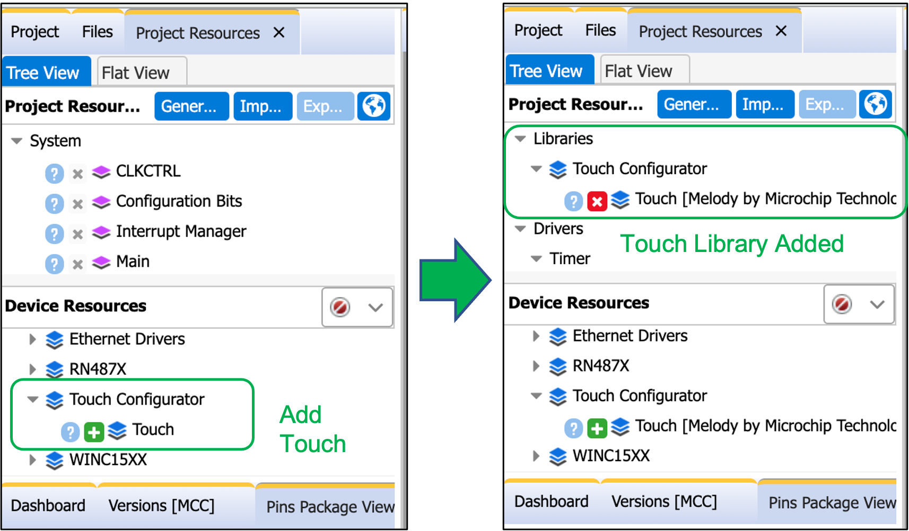
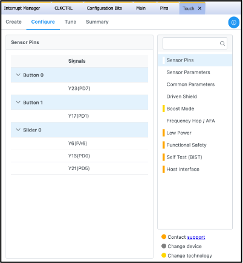
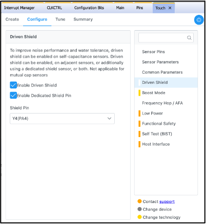
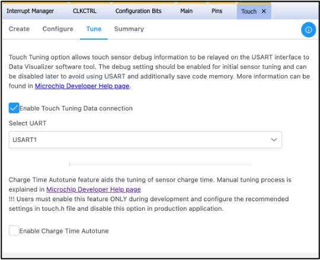
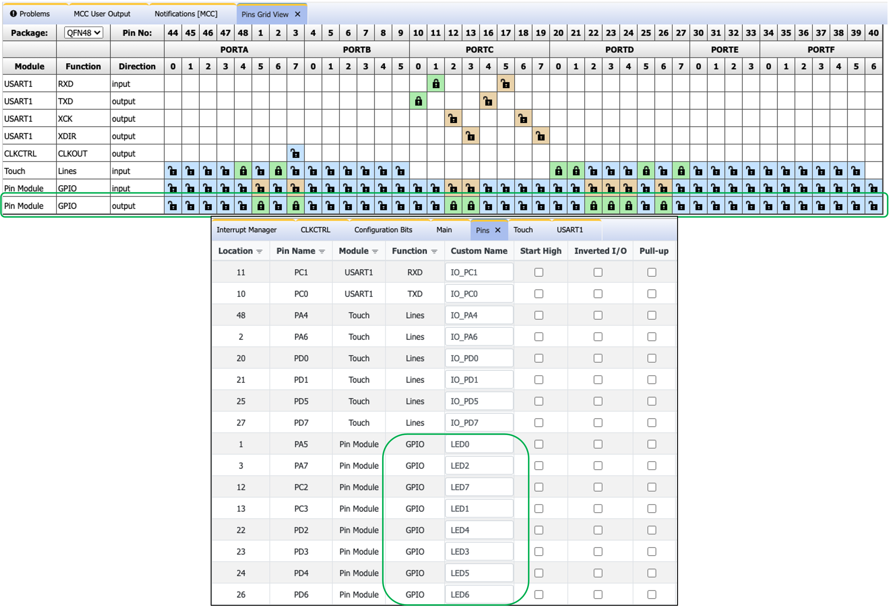
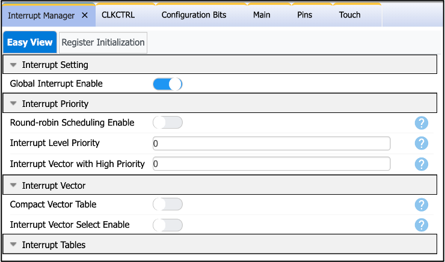
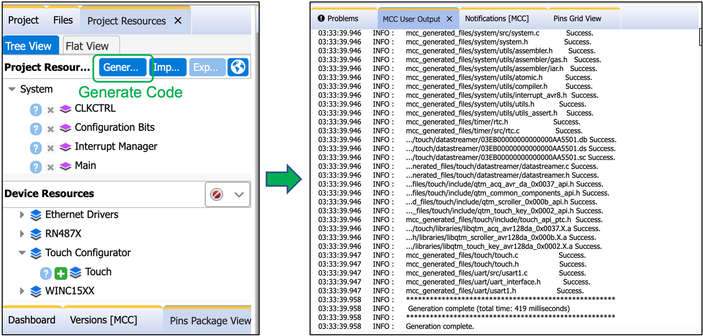
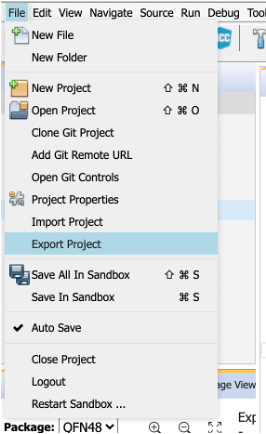
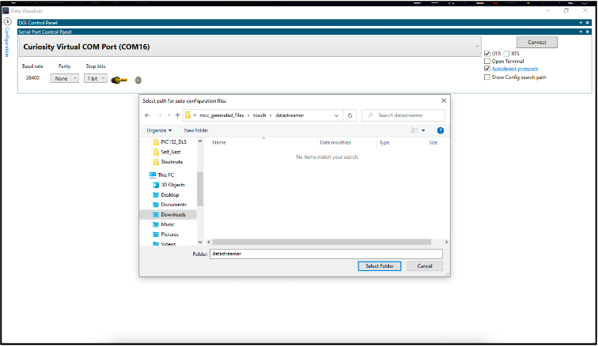
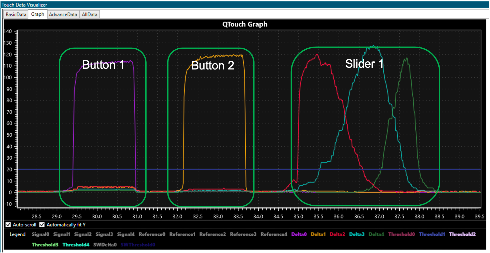

[](https://www.microchip.com)

# AVR128DA48 with QT7 Example Developed using MPLAB Xpress

This example demonstrates touch application with data visualization on AVR128DA48 Curiosity Nano and Curiosity Nano Touch Adapter Kit with the QT7 extension board. It was deliberately designed to showcase MPLAB Xpress with Discover Integration.

## Related Documentation

- [AVR128DA48 Curiosity Nano User Guide](https://ww1.microchip.com/downloads/en/DeviceDoc/AVR128DA48-Curiosity-Nano-UG-DS50002971B.pdf)
- [Curiosity Nano Touch Adapter Kit user guide](https://ww1.microchip.com/downloads/en/DeviceDoc/40002191A.pdf)
- [QT7 Xplained Pro user guide](https://ww1.microchip.com/downloads/en/DeviceDoc/QT7%20Xplained%20Pro%20User%20Guide%2050002725A.pdf)
- [MPLAB® Data Visualizer user guide](https://www.microchip.com/content/dam/mchp/documents/DEV/ProductDocuments/UserGuides/MPLAB_Data_Visualizer_50003001A.pdf)

## Required Software

- [MPLAB® Xpress](https://www.microchip.com/xpress) (v1.0 onwards) or [MPLAB® X IDE](https://www.microchip.com/en-us/development-tools-tools-and-software/mplab-x-ide?utm_source=GitHub&utm_medium=TextLink&utm_campaign=MCU8_MMTCha_MPAE_Examples&utm_content=avr128da48-qt7-touch-xpress-github) (v5.45 onwards) 
- [MPLAB XC8](https://www.microchip.com/en-us/development-tools-tools-and-software/mplab-xc-compilers?utm_source=GitHub&utm_medium=TextLink&utm_campaign=MCU8_MMTCha_MPAE_Examples&utm_content=avr128da48-qt7-touch-xpress-github) (v2.31 onwards)
- [AVR-Dx_DFP](https://packs.download.microchip.com/) (v1.6.76 onwards)
- [MPLAB® Data Visualizer](https://www.microchip.com/en-us/development-tools-tools-and-software/embedded-software-center/mplab-data-visualizer)
- [MPLAB® Code Configurator](https://www.microchip.com/mplab/mplab-code-configurator) (v4.1.0 onwards) 
- [MPLAB® Melody Library](https://www.microchip.com/en-us/development-tools-tools-and-software/embedded-software-center/mplab-code-configurator) (v1.37.25 onwards)

## Required Hardware
- [QT7](https://www.microchip.com/developmenttools/ProductDetails/atqt7-xpro)
- [Curiosity Nano Touch Adapter Kit](https://www.microchip.com/DevelopmentTools/ProductDetails/PartNO/AC80T88A)
- [AVR128DA48 Curiosity Nano](https://www.microchip.com/DevelopmentTools/ProductDetails/PartNO/DM164151)

## Bench Test Set-up
1. Connect [QT7](https://www.microchip.com/developmenttools/ProductDetails/atqt7-xpro) to [Curiosity Nano Touch Adapter Kit](https://www.microchip.com/DevelopmentTools/ProductDetails/PartNO/AC80T88A) (EXT1).
2. Connect [Curiosity Nano Touch Adapter Kit](https://www.microchip.com/DevelopmentTools/ProductDetails/PartNO/AC80T88A) to [AVR128DA48 Curiosity Nano](https://www.microchip.com/DevelopmentTools/ProductDetails/PartNO/DM164151).
3. Connect PC to the MCU board Debug USB port.

## Firmware Development I (Easy Method)
1. Click on "Open with", then Xpress.
2. Go to the *Device Programming Section* (Step 11)

## Firmware Development II (Step-by-Step)
0. Open a web browser and go to [MPLAB® Xpress](https://www.microchip.com/xpress).
1. Create a new AVR128DA48 standalone project and click on the MCC icon.
2. Go to the "Device Resources" Pane and Add the **Touch** library.



3. Go to "Touch" and then "Create" tab. Create **2 buttons** and **1 slider with 3 segments**.


4. Go to "Configure -> Sensor Pins" tab. Assign the pins to the buttons and sensors as seen in the image below.



5. Go to "Configure -> Driven Shield" tab. Check both "Enable Driven Shield" and "Enable Dedicated Shield Pin". Assign Y4(PA4) pin to the Shield Pin.



6. Go to "Tune" tab. Check "Enable Touch Tuning Data connection" and select USART1 from the drop-down menu.



7. Go to "Pin Grid View" Pane and enable 8 GPIO outputs then label them on "Pins" tab as seen on the image below.



8. Go to "Interrupt Manager" tab. Toggle "Global Interrupt Enable" switch.



9. Go to "Project Resources" Pane and click on "Generate Button". You should see **Generation Complete** message on the "MCC Output" Pane.



10. Go to "Project" Pane, then "Source Files" and double click on the *main.c* file. Then add the following lines of code as described below.

Reference the **extern** variable and declare the global variables and prototypes.
```c
/*----------------------------------------------------------------------------
 *   Extern variables
 *----------------------------------------------------------------------------*/
extern volatile uint8_t measurement_done_touch;

/*----------------------------------------------------------------------------
 *   Global variables
 *----------------------------------------------------------------------------*/
uint8_t key_status1 = 0;

uint8_t  scroller_status1   = 0;
uint16_t scroller_position1 = 0;

/*----------------------------------------------------------------------------
 *   prototypes
 *----------------------------------------------------------------------------*/
void touch_status_display1(void);
``` 
Edit **main** function to the following:

```c
int main(void)
{
    SYSTEM_Initialize();
 
    while(1)
    {
        touch_process();

	    if (measurement_done_touch == 1)
        {
		    measurement_done_touch = 0;
            touch_status_display1();
	    }
    }    
}
```

And finally, define the touch prototype.
```c
/*============================================================================
void touch_status_display(void)
------------------------------------------------------------------------------
Purpose: Sample code snippet to demonstrate how to check the status of the
         sensors
Input  : none
Output : none
Notes  : none
============================================================================*/
void touch_status_display1(void)
{
	key_status1 = get_sensor_state(0) & 0x80;
	if (0u != key_status1)
		LED6_SetLow();
	else
		LED6_SetHigh();

	key_status1 = get_sensor_state(1) & 0x80;
	if (0u != key_status1)
		LED7_SetLow();
	else
		LED7_SetHigh();

	scroller_status1   = get_scroller_state(0);
	scroller_position1 = get_scroller_position(0);

	LED0_SetHigh();
	LED1_SetHigh();
	LED2_SetHigh();
	LED3_SetHigh();
	LED4_SetHigh();
	LED5_SetHigh();

	if (0u != scroller_status1) 
    {
		LED5_SetLow();
		if (scroller_position1 > 43)  LED4_SetLow();
		if (scroller_position1 > 85)  LED3_SetLow();
		if (scroller_position1 > 120) LED2_SetLow();
		if (scroller_position1 > 165) LED1_SetLow();
		if (scroller_position1 > 213) LED0_SetLow();
	}
}
```

*Device Programming*

11. Click on "Make and Program Device". A hex file will be downloaded to your PC.
12. Copy this hex file to the AVR128DA48 Curiosity Nano Storage Drive.

*Data Visualization*

13. Back to MPLAB® Xpress, click on "File" Menu and then "Export Project". A zipped file will be downloaded to your PC. Unzip this file and remember its directory location.



14. Open Data Visualizer. Go to "Serial Port Control" Panel. Click on the "Autodetect protocols" hyperlink. Then browse the unzipped project file to **xxx/mcc_generated_files/touch/datastreamer**. Finally, click on "Connect".





## Summary
This example has illustrated how to use the AVR128DA48 Curiosity Nano with QT7 extension board done through MPLAB Xpress and Discover.