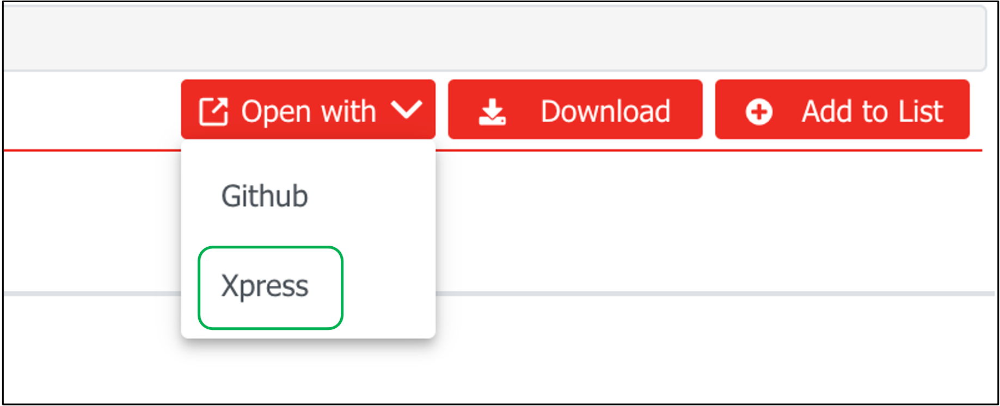
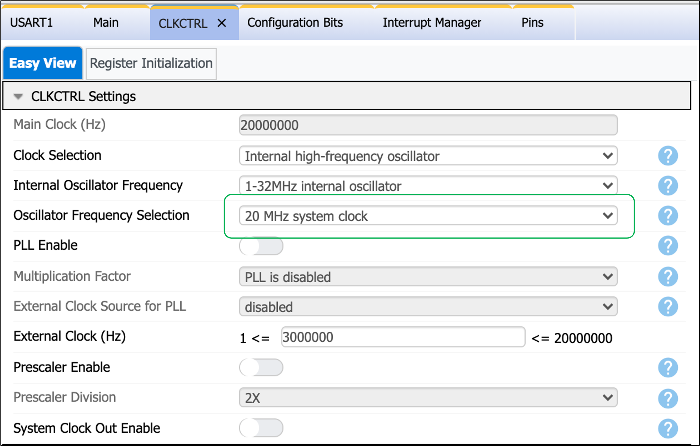
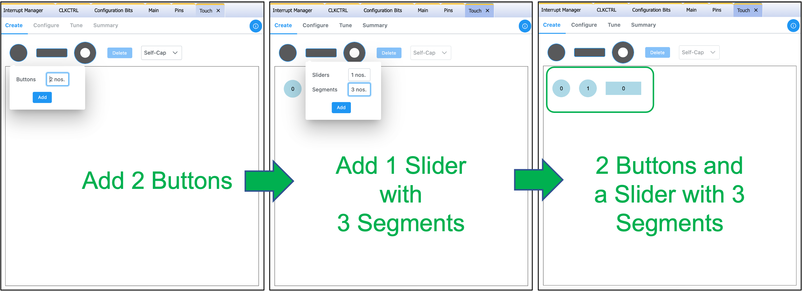
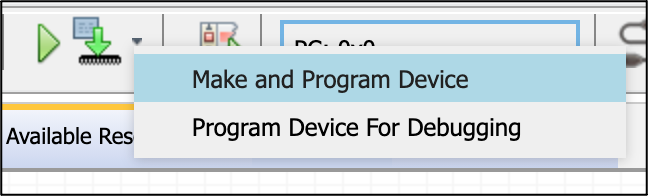

[](https://www.microchip.com)

# AVR128DA48 with QT7 Example Developed using MPLAB Xpress

This example demonstrates a touch application with tuning on an AVR128DA48 Curiosity Nano and with the QT7 Explained Pro Extension Kit. It was written to showcase MPLAB® Xpress and MPLAB® Discover integration.

## Related Documentation

- [AVR128DA48 Curiosity Nano User Guide](https://ww1.microchip.com/downloads/en/DeviceDoc/AVR128DA48-Curiosity-Nano-UG-DS50002971B.pdf)
- [Curiosity Nano Touch Adapter Kit user guide](https://ww1.microchip.com/downloads/en/DeviceDoc/40002191A.pdf)
- [QT7 Xplained Pro user guide](https://ww1.microchip.com/downloads/en/DeviceDoc/QT7%20Xplained%20Pro%20User%20Guide%2050002725A.pdf)
- [Atmel Data Visualizer user guide](https://www.microchip.com/en-us/development-tools-tools-and-software/embedded-software-center/atmel-data-visualizer)

## Required Software

- [MPLAB® Xpress](https://www.microchip.com/xpress) (v1.0 onwards) or [MPLAB® X IDE](https://www.microchip.com/en-us/development-tools-tools-and-software/mplab-x-ide?utm_source=GitHub&utm_medium=TextLink&utm_campaign=MCU8_MMTCha_MPAE_Examples&utm_content=avr128da48-qt7-touch-xpress-github) (v5.45 onwards) 
- [MPLAB XC8](https://www.microchip.com/en-us/development-tools-tools-and-software/mplab-xc-compilers?utm_source=GitHub&utm_medium=TextLink&utm_campaign=MCU8_MMTCha_MPAE_Examples&utm_content=avr128da48-qt7-touch-xpress-github) (v2.31 onwards)
- [AVR-Dx_DFP](https://packs.download.microchip.com/) (v1.6.76 onwards)
- [Atmel Data Visualizer user guide](https://www.microchip.com/en-us/development-tools-tools-and-software/embedded-software-center/atmel-data-visualizer) (v2.20.674 onwards) 
- [MPLAB® Melody Library](https://www.microchip.com/en-us/development-tools-tools-and-software/embedded-software-center/mplab-code-configurator) (v1.37.25 onwards)

## Required Hardware
- [QT7 Explained Pro Extension Kit](https://www.microchip.com/developmenttools/ProductDetails/atqt7-xpro)
- [Curiosity Nano Touch Adapter Kit](https://www.microchip.com/DevelopmentTools/ProductDetails/PartNO/AC80T88A)
- [AVR128DA48 Curiosity Nano](https://www.microchip.com/DevelopmentTools/ProductDetails/PartNO/DM164151)

## Hardware Set-up
1. Connect [QT7 Explained Pro Extension Kit](https://www.microchip.com/developmenttools/ProductDetails/atqt7-xpro) to [Curiosity Nano Touch Adapter Kit](https://www.microchip.com/DevelopmentTools/ProductDetails/PartNO/AC80T88A) (EXT1).
2. Connect [Curiosity Nano Touch Adapter Kit](https://www.microchip.com/DevelopmentTools/ProductDetails/PartNO/AC80T88A) to [AVR128DA48 Curiosity Nano](https://www.microchip.com/DevelopmentTools/ProductDetails/PartNO/DM164151).
3. Connect PC to Curiosity Nano USB port.

## Alternative I: Direct Firmware Download
1. Click "Open with" in MPLAB® Discover, then select "Xpress".<br/>
2. Refer to the [Device Programming Section](#markdown-header-Device-Programming) (Step 13 of Alternative II: Firmware Configuration)

## Alternative II: Firmware Configuration
1. Open a web browser then go to [MPLAB® Xpress](https://www.microchip.com/xpress). If this if your first time, you would be prompted to log in your myMicrochip account.
2. Create a new AVR128DA48 standalone project and click on the MCC icon  .
#### Set system clock
3. Go to "CLKCTRL" (clock control) tab. Change the "Oscillator Frequency Selection" drop-down box to "20 MHz system clock".<br/>
#### Add touch library
4. Go to "Device Resources" Pane and Add the **Touch** library. We will use this to add touch functionality to our project.<br/>
#### Configure touch library
5. Go to "Touch" tab and then "Create" tab. Create **2 self-cap buttons** and **1 self-cap slider with 3 segments**.<br/>
6. Go to "Configure -> Sensor Pins" tab. Assign the pins to the buttons and sliders as seen in the image below. For further information on the pin mapping open [Touch PIn Configurator](https://www.microchip.com/en-us/development-tool/AC80T88A).<br/>
#### Imporve Noise Perfomance and Water Tolerance
7. Go to "Configure -> Driven Shield" tab. Check both "Enable Driven Shield" and "Enable Dedicated Shield Pin". Assign Y4(PA4) pin to the Shield Pin. Driven shield will improve noise performance and water tolerance.<br/>
#### Enable Touch Tuning
8. Go to "Tune" tab. Check "Enable Touch Tuning Data connection" and select USART1 from the drop-down menu. USART1 is directly connected to AVR128DA48 curiosity nano debug header.<br/>
#### Configure/Assign AVR128DA48 GPIOs to the QT7 LEDs 
9. Go to "Pin Grid View" Pane and enable 8 GPIO outputs then label them on "Pins" tab as seen on the image below. The pin labels are needed to improve code readability and is also used for the generated LED functions. For further information on the pin mapping open [Touch PIn Configurator](https://www.microchip.com/en-us/development-tool/AC80T88A).<br/>
#### Enable Global Interrupt
10. Go to "Interrupt Manager" tab. Toggle "Global Interrupt Enable" switch. The **Touch** library was designed using interrupts to ensure the timing of touch acqusition to be in sync.<br/>
#### Generate the **Touch** libray code
11. Go to "Project Resources" Pane and click on "Generate" Button. You should see **Generation Complete** message on the "MCC Output" Pane.<br/>
#### Edit *main.c* to use the configured touch functionality
12. Go to "Project" Pane, then "Source Files" and double click on the *main.c* file. Then add the following lines of code as described below.

Reference the **extern** variable and declare the global variables and prototypes. This parameters will be used thoughout the project.
```c
/*----------------------------------------------------------------------------
 *   Extern variables
 *----------------------------------------------------------------------------*/
extern volatile uint8_t measurement_done_touch;

/*----------------------------------------------------------------------------
 *   Global variables
 *----------------------------------------------------------------------------*/
uint8_t key_status1 = 0;

uint8_t  scroller_status1   = 0;
uint16_t scroller_position1 = 0;

/*----------------------------------------------------------------------------
 *   prototypes
 *----------------------------------------------------------------------------*/
void touch_status_display1(void);
``` 
Edit **main()** function to the following:

```c
int main(void)
{
    SYSTEM_Initialize();
 
    while(1)
    {
        touch_process();

	    if (measurement_done_touch == 1)
        {
		    measurement_done_touch = 0;
            touch_status_display1();
	    }
    }    
}
```
**touch_process()* will enable use of the defined buttons and slider.

And finally, define the touch_status_display1() function. This function turns on/off the approriate LEDs when touch is observed on the buttons or slider.
```c
/*============================================================================
void touch_status_display(void)
------------------------------------------------------------------------------
Purpose: Sample code snippet to demonstrate how to check the status of the
         sensors
Input  : none
Output : none
Notes  : none
============================================================================*/
void touch_status_display1(void)
{
	key_status1 = get_sensor_state(0) & 0x80;
	if (0u != key_status1)
		LED6_SetLow();
	else
		LED6_SetHigh();

	key_status1 = get_sensor_state(1) & 0x80;
	if (0u != key_status1)
		LED7_SetLow();
	else
		LED7_SetHigh();

	scroller_status1   = get_scroller_state(0);
	scroller_position1 = get_scroller_position(0);

	LED0_SetHigh();
	LED1_SetHigh();
	LED2_SetHigh();
	LED3_SetHigh();
	LED4_SetHigh();
	LED5_SetHigh();

	if (0u != scroller_status1) 
    {
		LED5_SetLow();
		if (scroller_position1 > 43)  LED4_SetLow();
		if (scroller_position1 > 85)  LED3_SetLow();
		if (scroller_position1 > 120) LED2_SetLow();
		if (scroller_position1 > 165) LED1_SetLow();
		if (scroller_position1 > 213) LED0_SetLow();
	}
}
```

#### Device Programming

13. Click on "Make and Program Device". A hex file will be downloaded to your PC.<br/>
14. Copy this hex file to the AVR128DA48 Curiosity Nano Storage Drive. This drive should have appeared in your PC when you initially connected the AVR128DA48 Curiosity Nano to the PC.

#### Touch Tuning

15. Back to MPLAB® Xpress, click on "File" Menu and then "Export Project". A zipped file will be downloaded to your PC. Unzip this file and remember its directory location.<br/>
16. Open Data Visualizer. Go to "Serial Port Control" Panel. Click on the "Autodetect protocols" hyperlink. Then browse the unzipped project file to **xxx/mcc_generated_files/touch/datastreamer**. Finally, click on "Connect".<br/><br/>
## Summary
This example illustrates how to use the AVR128DA48 Curiosity Nano with QT7 Explained Pro Extension Kit when configured and programmed through MPLAB® Xpress and MPLAB® Discover.